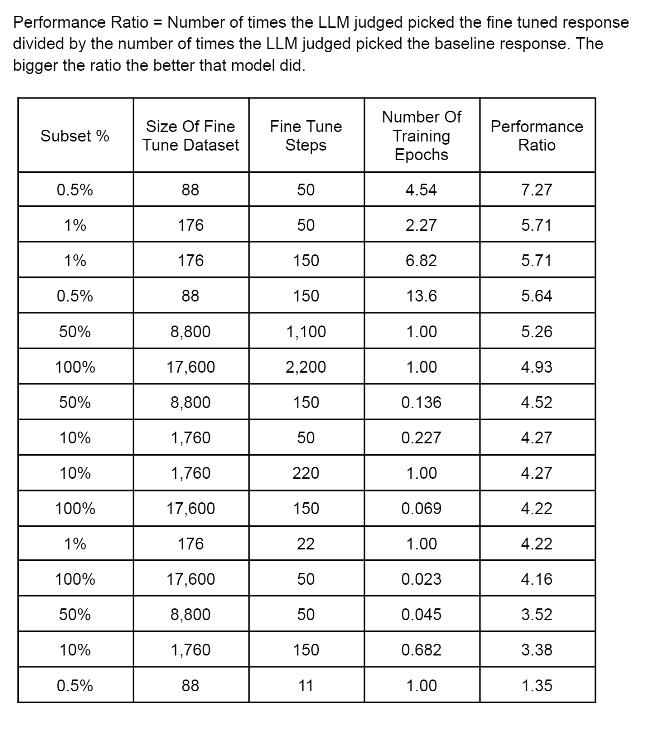
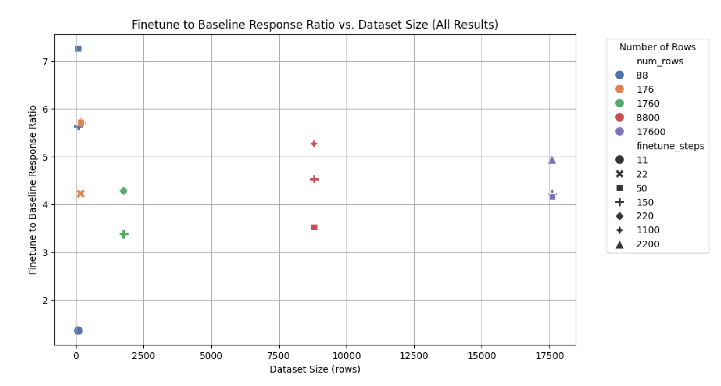
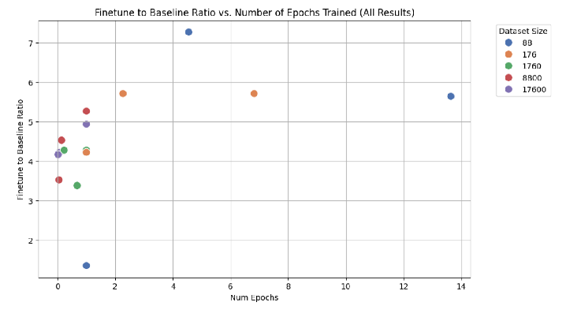

# 🚀 Fine-Tuning LLaMA 3 8B with Synthetic Data for Specialized Tasks

**Author**: Benito Infantino  
**Date**: August 2024  

## 📚 Table of Contents
- [📝 Project Overview](#-project-overview)
- [🎯 Objectives](#-objectives)
- [📊 Methods](#-methods)
- [🔬 Key Results](#-key-results)
- [💡 Key Learnings](#-key-learnings)
- [⚙️ Technologies Used](#️-technologies-used)
- [📈 Results Visualization](#-results-visualization)
  - [Results For All Experiments](#results-for-all-experiments)
  - [Performance Ratio vs Data Size](#results-for-performance-ratio-with-respect-to-data-size)
  - [Performance Ratio vs Training Steps](#results-for-performance-ratio-with-respect-to-training-steps)
- [🔧 How to Reproduce](#-how-to-reproduce)
- [🛠️ Challenges Overcome](#️-challenges-overcome)
- [📄 Research Paper](#-research-paper)
- [🤗 Hugging Face Model Repository](#-hugging-face-model-repository)
- [🎯 Conclusion](#-conclusion)

## 📝 Project Overview
This project aims to create a repeatable framework for fine-tuning **LLaMA 3 8B** on specialized tasks using **synthetic datasets**. The goal is to enable businesses to fine-tune open-source models for specific use cases without compromising data privacy.

For this project, the task was generating **social media posts** for sales content by adhering to:

- **Universal Criteria**: Guidelines applicable to all posts, such as using strong calls to action, capturing attention quickly, and highlighting unique selling points.
- **Post Type-Specific Criteria**: Specific guidelines for each type of post (e.g., promotional, educational), focusing on the content and style unique to each category.

By fine-tuning models based on these criteria, the goal was to create models that generate high-quality social media content that aligns with both general and specific marketing strategies, without needing detailed prompts.

## 🎯 Objectives
- **Main Goal**: Develop a repeatable process to fine-tune large language models like LLaMA 3 8B for specific tasks using **synthetic data**, focusing on implementing both universal and post-specific criteria in content generation.
- **Business Use Case**: Automate the generation of social media posts that adhere to a company's marketing guidelines and strategies, reducing the need for manual prompt engineering while ensuring consistency and effectiveness in messaging.

## 📊 Methods
1. **Dataset Creation**:
   - Generated a **synthetic dataset** using LLaMA 3 8B to simulate real-world business scenarios.
   - **17,600 rows** of data across 11 post types, 5 tones, 3 lengths, and 16 companies with 20 products each.
   
2. **Fine-Tuning**:
   - Used the **LoRA** (Low-Rank Adaptation) technique to fine-tune the model efficiently, minimizing compute and memory usage.
   - Fine-tuned on varying data sizes, from **88 rows** (0.5% of the total data) to the full 17,600 rows, to test how dataset size affects performance.

3. **Model Evaluation**:
   - Baseline and fine-tuned responses were compared using LLaMA 70B to select the best output.
   - Experiments focused on how **data size** and **training steps** impact fine-tuning quality.

## 🔬 Key Results
- **Best performance** was achieved with **only 88 rows** of synthetic data, fine-tuned over **multiple epochs**.
- **Performance Ratio**: The fine-tuned model outperformed the baseline with a ratio of **7.27** when trained on 88 rows with 50 steps.
- More data did not always lead to better results — the number of **training epochs** was more significant.

## 💡 Key Learnings
- Fine-tuning can be highly effective with small, diverse datasets when paired with the right techniques (e.g., LoRA).
- Proper management of **GPU memory** is crucial for running multiple experiments efficiently on limited hardware (e.g., Google Colab A100).

## ⚙️ Technologies Used
- **LLaMA 3 8B & 70B**
- **Groq API** (for faster token generation)
- **LoRA**, **Unsloth**, **BitsAndBytes** for efficient fine-tuning
- **Hugging Face Transformers**
- **Supervised Fine-Tuning Trainer (SFTT)**

## 📈 Results Visualization

*All Results Can Be Found in the Paper*

### Results For All Experiments

### Results For Performance Ratio with respect to Data Size

### Results For Performance Ratio with respect to Training Steps

## 🔧 How to Reproduce
1. Clone the repository.
2. Follow the order of Jupyter notebooks (1, 2, 3, 4).
3. Modify the code and parameters to fit your task-specific requirements, then rerun the notebooks.
4. The notebooks contain all the fine-tuning and evaluation steps.

## 🛠️ Challenges Overcome
- **Data Diversity**: Created dynamic prompts and loops to generate a diverse synthetic dataset.
- **Memory Management**: Managed **RAM constraints** by clearing variables after each model run.
- **Response Scoring**: Switched from arbitrary scoring to using LLaMA 70B to **choose the best response** between baseline and fine-tuned outputs.

## 📄 Research Paper

You can read the full research paper detailing the methods, experiments, and results here:

[Read the Research Paper](./infantino_benito_research_paper.pdf)

## 🤗 Hugging Face Model Repository

You can access the fine-tuned models from this project on Hugging Face:

Click the link above to view or download the models and try them out in your own projects.

## 🎯 Conclusion
This project demonstrated that even small datasets (e.g., 88 rows) can be highly effective for fine-tuning LLMs when combined with techniques like **LoRA** and **efficient training epochs**. This opens the door for businesses to fine-tune models with minimal data while maintaining high performance.

---

Thank you for checking out my project! Feel free to explore the code, data, and models. 💻
